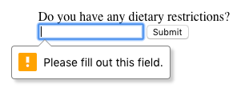
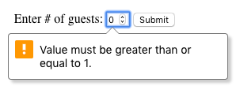
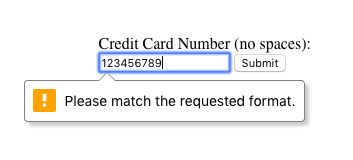

# FORM VALIDATION

## Introduction to HTML Form Validation

Ever wonder how a login page actually works? Or why the combination of a username and password grants you access to a website? The answers lie in validation. Validation is the concept of checking user provided data against the required data.

There are different types of validation. One type is server-side validation, this happens when data is sent to another machine (typically a server) for validation. An example of this type of validation is the usage of a login page. The form on the login page accepts username and password input, then sends the data to a server that checks that the pair matches up correctly.

On the other hand, we use client-side validation if we want to check the data on the browser (the client). This validation occurs before data is sent to the server. Different browsers implement client-side validation differently, but it leads to the same outcome.

Shared among the different browsers are the benefits of using HTML5’s built-in client-side validation. It saves us time from having to send information to the server and wait for the server to send back confirmation or rejection of the data. This can also help us protect our server from malicious code or data from a malicious user. It also allows us to quickly give feedback to users for specific fields rather than having them fill in a form again if the data they input into the form was rejected.

---

## **Table of Contents :**

- [Requiring an Input](###Requiring an Input)
- [Set a Minimum and Maximum](###Set a Minimum and Maximum)
- [Checking Text Length](###Checking Text Length)
- [Matching a Pattern](###Matching a Pattern)

### **_Requiring an Input :_**

---

Sometimes we have fields in our `<form>`s which are not optional, i.e. there must be information provided before we can submit it. To enforce this rule, we can add the required attribute to an `<input>` element.

Take for example:

```html
<form action="/example.html" method="POST">
  <label for="allergies">Do you have any dietary restrictions?</label>
  <br />
  <input id="allergies" name="allergies" type="text" required />
  <br />
  <input type="submit" value="Submit" />
</form>
```

This renders a text box, and if we try to submit the `<form>` without filling it out we get this message:



The styling of the message varies from browser to browser, the picture above depicts the message in a Chrome browser

### **_Set a Minimum and Maximum :_**

---

Another built-in validation we can use is to assign a minimum or maximum value for a number field, e.g. `<input type="number">` and `<input type="range">`. To set a minimum acceptable value, we use the min attribute and assign a value. On the flip side, to set a maximum acceptable value, we assign the max attribute a value. Let’s see this in code:

```html
<form action="/example.html" method="POST">
  <label for="guests">Enter # of guests:</label>
  <input id="guests" name="guests" type="number" min="1" max="4" />
  <input type="submit" value="Submit" />
</form>
```

If a user tries to submit an input that is less than 1 a warning will appear:



A similar message will appear if a user tries to input a number greater than 4.

### **_Checking Text Length :_**

---

To set a minimum number of characters for a text field, we add the minlength attribute and a value to set a minimum value. Similarly, to set the maximum number of characters for a text field, we use the maxlength attribute and set a maximum value. Let’s take a look at these attributes in code:

```html
<form action="/example.html" method="POST">
  <label for="summary"
    >Summarize your feelings in less than 250 characters</label
  >
  <input
    id="summary"
    name="summary"
    type="text"
    minlength="5"
    maxlength="250"
    required
  />
  <input type="submit" value="Submit" />
</form>
```

If a user tries to submit the `<form>` with less than the set minimum, this message appears:


And if a user tries to type in more than the maximum allowed number of characters, they don’t get a warning message, but they can’t type it in!

### **_Matching a Pattern :_**

---

n addition to checking the length of a text, we could also add a validation to check how the text was provided. For cases when we want user input to follow specific guidelines, we use the pattern attribute and assign it a regular expression, or regex. Regular expressions are a sequence of characters that make up a search pattern. If the input matches the regex, the form can be submitted.

Let’s say we wanted to check for a valid credit card number (a 14 to 16 digit number). We could use the regex: [0-9]{14,16} which checks that the user provided only numbers and that they entered at least 14 digits and at most 16 digits.

To add this to a form:

```html
<form action="/example.html" method="POST">
  <label for="payment">Credit Card Number (no spaces):</label>
  <br />
  <input
    id="payment"
    name="payment"
    type="text"
    required
    pattern="[0-9]{14,16}"
  />
  <input type="submit" value="Submit" />
</form>
```

With the pattern in place, users can’t submit the `<form>` with a number that doesn’t follow the regex. When they try, they’ll see a validation message like so:



---

To view the full _HTML_ code and run this on server [Click Here](index.html)
