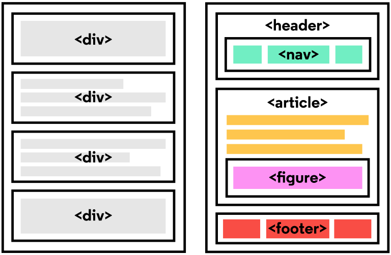

# SEMANTIC HTML

## Introduction to Semantic HTML

When building web pages, we use a combination of non-semantic HTML and Semantic HTML. The word semantic means “relating to meaning,” so semantic elements provide information about the content between the opening and closing tags.

By using Semantic HTML, we select HTML elements based on their meaning, not on how they are presented. Elements such as `<div>` and `<span>` are not semantic elements since they provide no context as to what is inside of those tags.



For example, instead of using a `<div>` element to contain our header information, we could use a `<header>` element, which is used as a heading section. By using a `<header>` tag instead of a `<div>`, we provide context as to what information is inside of the opening and closing tag.

**Why use Semantic HTML?**

- **Accessibility:** Semantic HTML makes webpages accessible for mobile devices and for people with disabilities as well. This is because screen readers and browsers are able to interpret the code better.
- **SEO:** It improves the website SEO, or Search Engine Optimization, which is the process of increasing the number of people that visit your webpage. With better SEO, search engines are better able to identify the content of your website and weight the most important content appropriately.
- **Easy to Understand:** Semantic HTML also makes the website’s source code easier to read for other web developers.

To better understand this, you can think of comparing non-semantic HTML to going into a store with no signs on the aisles. Since the aisles aren’t labeled, you don’t know what products are in those aisles. However, stores that do have signs for each aisle make it a lot easier to find the items you need, just like Semantic HTML.

---

## **Table of Contents :**

<ul>
<li><a href="#tag-htmltag">Header and Nav</a></li>
<li><a href="#tag-htmltag1">Main and Footer</a></li>
<li><a href="#tag-htmltag2">Article and Section</a></li>
<li><a href="#tag-htmltag3">The Aside Element</a></li>
<li><a href="#tag-htmltag4">Figure and Figcaption</a></li>
<li><a href="#tag-htmltag5">Audio and Attributes</a></li>
<li><a href="#tag-htmltag6">Video and Embed</a></li>
</ul>

### <a id="tag-htmltag" href="#tag-htmltag"><strong><em>Header and Nav :</strong></em></a>

---

Let’s take a look at some semantic elements that assist in the structure of a web page. A `<header>` is a container usually for either navigational links or introductory content containing `<h1>` to`<h6>` headings.

The example below shows `<header>` in action:

```html
<header>
  <h1>
    Everything you need to know about pizza!
  </h1>
</header>
```

This can be compared to the code below which uses a `<div>` tag instead of a `<header>` tag:

```html
<div id="header">
  <h1>
    Everything you need to know about pizza!
  </h1>
</div>
```

By using a `<header>` tag, our code becomes easier to read. It is much easier to identify what is inside of the `<h1>`‘s parent tags, as opposed to a `<div>` tag which would provide no details as to what was inside of the tag.

A `<nav>` is used to define a block of navigation links such as menus and tables of contents. It is important to note that `<nav>` can be used inside of the `<header>` element but can also be used on its own.

Let’s take a look at the example below:

```html
<header>
  <nav>
    <ul>
      <li><a href="#home">Home</a></li>
      <li><a href="#about">About</a></li>
    </ul>
  </nav>
</header>
```

By using `<nav>` as a way to label our navigation links, it will be easier for not only us, but also for web browsers and screen readers to read the code.

### <a id="tag-htmltag1" href="#tag-htmltag1"><strong><em>Main and Footer :</strong></em></a>

---

Two more structural elements are `<main>` and `<footer>`. These elements along with `<nav>` and `<header>` help describe where an element is located based on conventional web development standards.

The element `<main>` is used to encapsulate the dominant content within a webpage. This tag is separate from the `<footer>` and the `<nav>` of a web page since these elements don’t contain the principal content. By using `<main>` as opposed to a `<div>` element, screen readers and web browsers are better able to identify that whatever is inside of the tag is the bulk of the content.

So how does `<main>` look when incorporated into our code? That’s a great question.

```html
<main>
  <header>
    <h1>Types of Sports</h1>
  </header>
  <article>
    <h3>Baseball</h3>
    <p>
      The first game of baseball was played in Cooperstown, New York in the
      summer of 1839.
    </p>
  </article>
</main>
```

As we see above, `<main>` contains an `<article>` and`<header>` tag with child elements that hold the most important information related to the page.

The content at the bottom of the subject information is known as the footer, indicated by the `<footer>` element. The footer contains information such as:

- Contact information
- Copyright information
- Terms of use
- Site Map
- Reference to top of page links

For example:

```html
<footer>
  <p>Email me at Codey@Codecademy.com</p>
</footer>
```

In the example above, the footer is used to contain contact information. The `<footer>` tag is separate from the `<main>` element and typically located at the bottom of the content.

### <a id="tag-htmltag2" href="#tag-htmltag2"><strong><em>Article and Section :</strong></em></a>

---

`<section>` defines elements in a document, such as chapters, headings, or any other area of the document with the same theme. For example, content with the same theme such as articles about cricket can go under a single `<section>`. A website’s home page could be split into sections for the introduction, news items, and contact information.

Here is an example of how to use `<section>`:

```html
<section>
  <h2>Fun Facts About Cricket</h2>
</section>
```

In the code above we created a `<section>` element to encapsulate the code. In `<section>` we added a `<h2>` element as a heading.

The `<article>` element holds content that makes sense on its own. `<article>` can hold content such as articles, blogs, comments, magazines, etc. An `<article>` tag would help someone using a screen reader understand where the article content (that might contain a combination of text, images, audio, etc.) begins and ends.

Here is an example of how to use `<article>`:

```html
<section>
  <h2>Fun Facts About Cricket</h2>
  <article>
    <p>A single match of cricket can last up to 5 days.</p>
  </article>
</section>
```

In the code above, the `<article>` element containing a fact about cricket was placed inside of the `<section>` element. It is important to note that a `<section>` element could also be placed in an `<article>` element depending on the context.

### <a id="tag-htmltag3" href="#tag-htmltag3"><strong><em>The Aside Element :</strong></em></a>

---

The `<aside>` element is used to mark additional information that can enhance another element but isn’t required in order to understand the main content. This element can be used alongside other elements such as `<article>` or `<section>`. Some common uses of the `<aside>` element are for:

- Bibliographies
- Endnotes
- Comments
- Pull quotes
- Editorial sidebars
- Additional information

Here’s an example of `<aside>` being used alongside `<article>`:

```html
<article>
  <p>
    The first World Series was played between Pittsburgh and Boston in 1903 and
    was a nine-game series.
  </p>
</article>
<aside>
  <p>
    Babe Ruth once stated, “Heroes get remembered, but legends never die.”
  </p>
</aside>
```

As shown above, the information within the `<article>` is the important content. Meanwhile the information within the `<aside>` enhances the information in `<article>` but is not required in order to understand it.

### <a id="tag-htmltag4" href="#tag-htmltag4"><strong><em>Figure and Figcaption :</strong></em></a>

---

`<figure>` is an element used to encapsulate media such as an image, illustration, diagram, code snippet, etc, which is referenced in the main flow of the document.

```html
<figure>
  
</figure>
```

In this code, we created a `<figure>` element so that we can encapsulate our `` tag. In `<figure>` we used the `` tag to insert an image onto the webpage. We used the src attribute within the `` tag so that we can link the source of the image.

It’s possible to add a caption to the image by using `<figcaption>`.

`<figcaption>` is an element used to describe the media in the `<figure>` tag. Usually, `<figcaption>` will go inside `<figure>`. This is different than using a `<p>` element to describe the content; if we decide to change the location of `<figure>`, the paragraph tag may get displaced from the figure while a `<figcaption>` will move with the figure. This is useful for grouping an image with a caption.

```html
<figure>
  
  <figcaption>This picture shows characters from Overwatch.</figcaption>
</figure>
```

In the example above, we added a `<figcaption>` into the `<figure>` element to describe the image from the previous example. This helps group the `<figure>` content with the `<figcaption>` content.

While the content in `<figure>` is related to the main flow of the document, its position is independent. This means that you can remove it or move it somewhere else without affecting the flow of the document.

### <a id="tag-htmltag5" href="#tag-htmltag5"><strong><em>Audio and Attributes :</strong></em></a>

---

The `<audio>` element is used to embed audio content into a document. Like `<video>`, `<audio>` uses src to link the audio source.

```html
<audio>
  <source src="iAmAnAudioFile.mp3" type="audio/mp3" />
</audio>
```

In this example, we created an `<audio>` element. Then we created a `<source>` element to encapsulate our audio link. In this case, iAmAnAudioFile.mp3 is our audio file. Then we specified the type by using type and named what kind of audio it is. Although not always necessary, it’s recommended that we state the type of audio as it helps the browser identify it more easily and determine if that type of audio file is supported by the browser.

We linked our audio file into the browser but now we need to give it controls. This is where attributes come in. Attributes provide additional information about an element.

Attributes allow us to do many different things to our audio file. There are many attributes for `<audio>` but today we’re going to be focusing on controls and src.

- **_controls:_** automatically displays the audio controls into the browser such as play and mute.
- **_src:_** specifies the URL of the audio file.

As you might have noticed, we already used the src attribute. Most attributes go in the opening tag of `<audio>`. For example, here’s how we could add both autoplay functionality and audio controls:

```html
<audio autoplay controls></audio>
```

### <a id="tag-htmltag6" href="#tag-htmltag6"><strong><em>Video and Embed :</strong></em></a>

---

By using a `<video>` element, we can add videos to our website. The `<video>` element makes it clear that a developer is attempting to display a video to the user.

Some attributes that can alter a video playback include:

- **_controls:_** When added in, a play/pause button will be added onto the video along with volume control and a fullscreen option.
- **_autoplay:_** The attribute which results in a video automatically playing as soon as the page is loaded.
- **_loop:_** This attribute results in the video continuously playing on repeat.

Below is an example of `<video>` being used with the controls attribute:

```html
<video src="coding.mp4" controls>Video not supported</video>
```

In the code above, a video file named coding.mp4 is being played. The “Video not supported” will only show up if the browser is unable to display the video.

Another tag that can be used to incorporate media content into a page is the `<embed>` tag, which can embed any media content including videos, audio files, and gifs from an external source. This means that websites that have an embed button have some form of media content that can be added to other websites. The `<embed>` tag is a self-closing tag, unlike the `<video>` element.

Below we’ll take a look at `<embed>` being used in action.

```html
<embed src="download.gif" />
```

In the example above, `<embed>` is being used to add in a gif from a local file known as download.gif. Embed can be used to add local files as well as media content straight from some other websites.

---

To view the full _HTML_ code and run this on server [Click Here](index.html)
